# 📚 Biblioteca Digital - Sistema de Gestión Integral


## 📖 Descripción

**Biblioteca Digital** es una aplicación web Full Stack diseñada para simular un e-commerce y sistema de gestión de libros. El proyecto diferencia claramente entre la experiencia del usuario final (cliente) y el panel de administración, implementando prácticas modernas de desarrollo web, seguridad y diseño UI/UX.

El objetivo fue crear una solución escalable que maneje autenticación segura, gestión de inventario con persistencia de datos y una interfaz amigable y responsiva.

---

## 📸 Capturas de Pantalla y Gifs

| Home | Catalogo |
|:---:|:---:|
|  |  |

| Registro | Login | Olvide Contraseña |
|:---:|:---:|:---:|
| 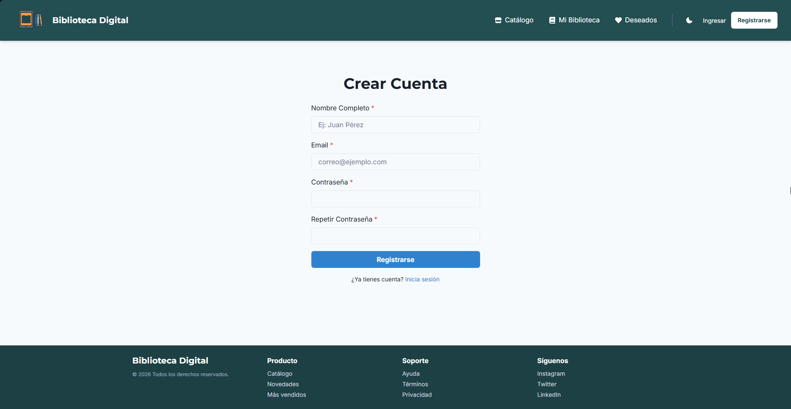 | 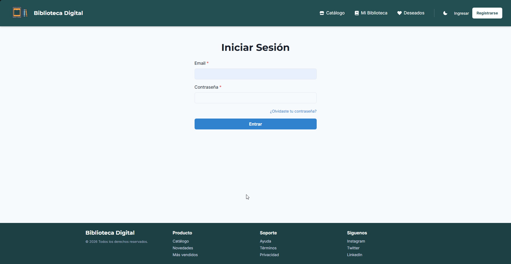 | 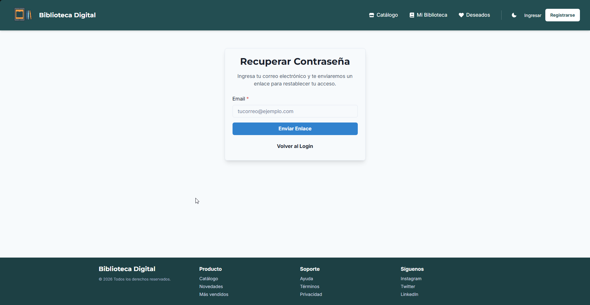

| Perfil de Usuario | Wishlist |
|:---:|:---:|
| 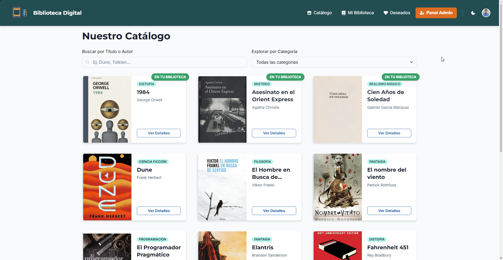 | 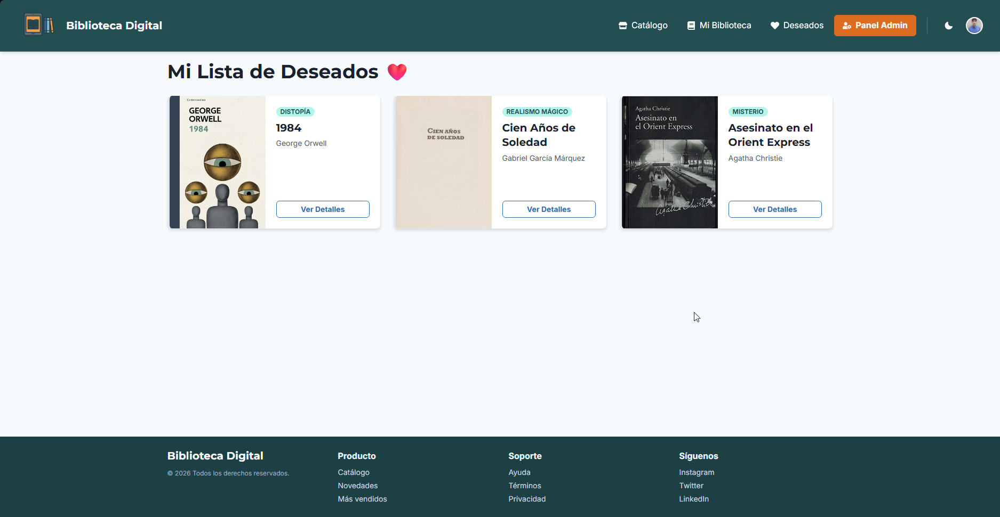 |

| Mi Biblioteca | Libro Detalle |
|:---:|:---:|
| 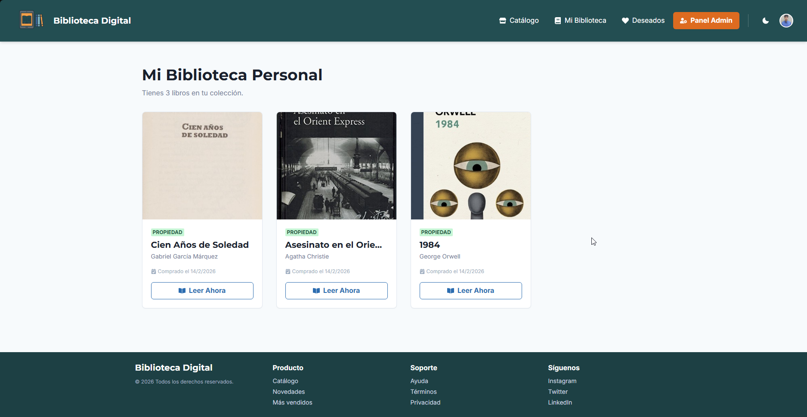 | 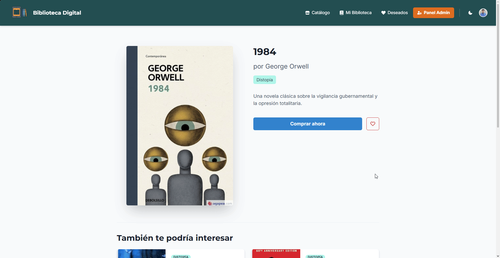 |

| Modal Pago | Lector |
|:---:|:---:|
|  | 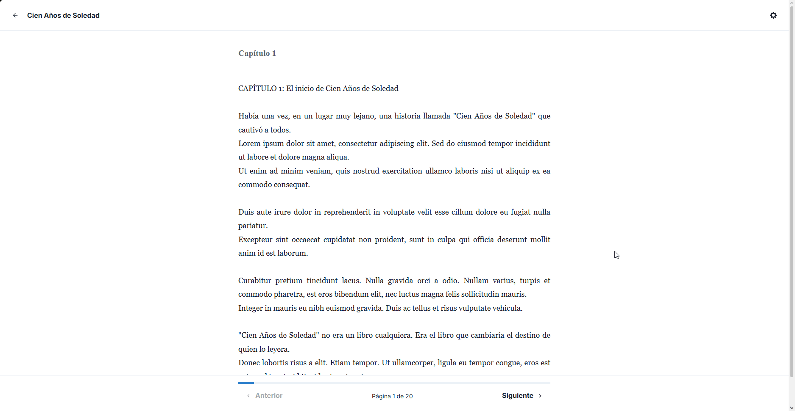 |

| Dashboard Admin | 
|:---:|
| 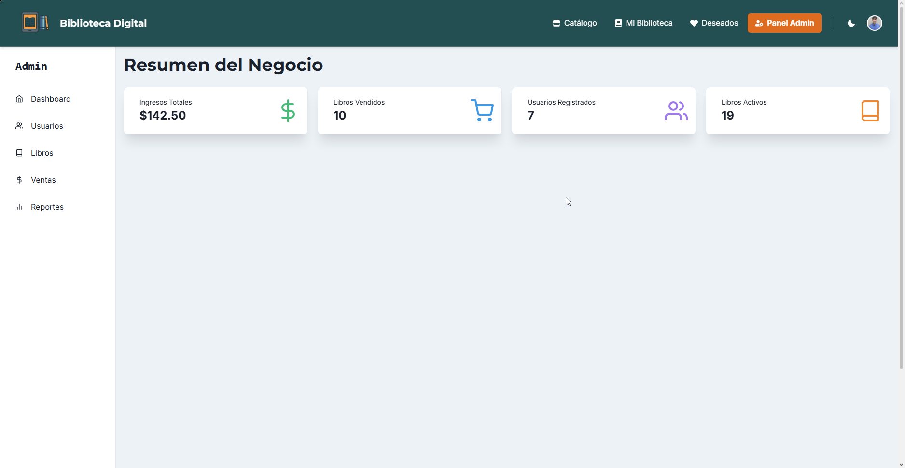 |

| Gestion usuarios | Gestion Ventas |
|:---:|:---:|
|  | 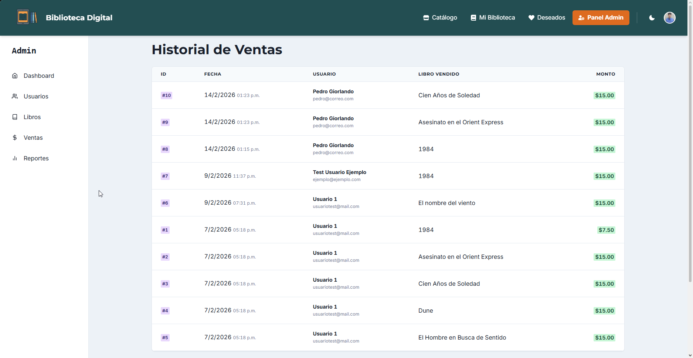 |

| Gestion libros | Reportes |
|:---:|:---:|
|  | 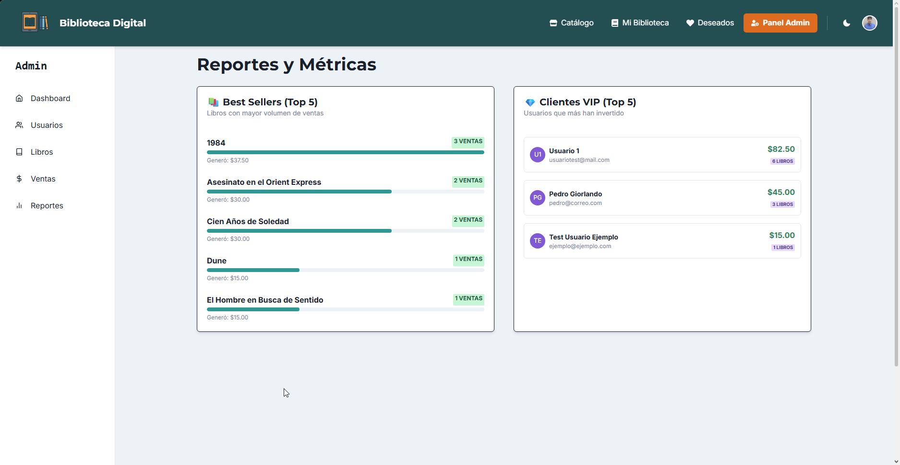 |

| Vista Movil | Modo Oscuro |
|:---:|:---:|
|  |  |

---

## 🚀 Funcionalidades Principales

### 👤 Experiencia de Usuario (Cliente)
* **Autenticación:** Registro e Inicio de Sesión seguros.
* **Catálogo Interactivo:** Exploración de libros con barra de búsqueda en tiempo real.
* **Gestión de Perfil:** Actualización de datos personales y **subida de foto de perfil** (Avatar) procesada en el servidor.
* **Carrito y Compras:** Simulación de proceso de compra.
* **Mi Biblioteca:** Acceso exclusivo a los libros adquiridos.
* **Lista de deseados (Wishlist):** Guardado de libros favoritos.
* **Promo Banner Inteligente:** Detecta si el usuario es nuevo (sin compras) para ofrecer descuentos.

### 🛠️ Panel de Administración (Backoffice)
* **Gestión de libros (CRUD):** * Crear y editar libros con subida de portadas.
    * **Baja Lógica (Soft Delete):** Los libros eliminados no se borran de la BD, solo se desactivan para mantener la integridad histórica.
* **Gestión de usuarios:** Visualización de usuarios y **control de roles** (Ascender/Degradar administradores).
* **Dashboard de Ventas:** Historial completo de transacciones.
* **Protección:** Rutas protegidas que verifican el rol de Administrador antes de permitir acciones sensibles.

### 🎨 UI/UX
* **Modo Oscuro/Claro:** Persistencia de tema preferido usando `localStorage`.
* **Feedback Visual:** Uso de Toasts, Modales, Spinners de carga y Alertas de confirmación.
* **Diseño Responsivo:** Adaptable a móviles y escritorio.

---

## 💻 Tecnologías Utilizadas

### Frontend
* **React + TypeScript:** Para una arquitectura de componentes robusta y tipado estático.
* **Chakra UI:** Biblioteca de componentes para un diseño accesible y moderno.
* **Context API:** Manejo de estado global para la Autenticación (`AuthContext`).
* **Axios:** Consumo de API REST.
* **React Router DOM:** Manejo de rutas y navegación SPA.

### Backend
* **Node.js + Express:** Servidor API RESTful.
* **MySQL:** Base de datos relacional.
* **JWT (JSON Web Token):** Manejo de sesiones seguras y stateless.
* **Bcryptjs:** Encriptación (hashing) de contraseñas.
* **Multer:** Middleware para la gestión y subida de archivos (imágenes).

---

## 🔧 Instalación y Despliegue Local

Sigue estos pasos para correr el proyecto en tu máquina:

### 1. Clonar el Repositorio
```bash
git clone [https://github.com/TU_USUARIO/TU_REPO.git](https://github.com/TU_USUARIO/TU_REPO.git)
cd biblioteca-digital
```

### 2. Configurar Base de datos
a. Asegúrate de tener MySQL instalado y corriendo.

b. Crea una base de datos vacía llamada biblioteca_digital.

c. Importa el archivo .sql (ubicado en la raíz del proyecto o carpeta db) para generar las tablas y datos.

### 3. Configurar Backend
```bash
cd backend
npm install
npm run dev
```
### 4. Configurar Frontend
```bash
cd frontend
npm install
npm run dev
```
¡Listo! La aplicación debería estar corriendo en http://localhost:5173.

✒️ Autor
Pedro Giorlando - Full Stack Developer - https://www.linkedin.com/in/pedro-giorlando/
